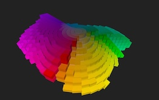

# workspace-rolodex

  
<a href="https://sbecker11.github.io/workspace-rolodex/">Here's </a> my Munsell Color Chips in 3-D

## See my related project <a href="https://github.com/sbecker11/workspace-munsell">workspace-munsell</a>

##  How to build this app
1. install node
2. in shell run "npm run build'
3. then run 'npm run start' 

