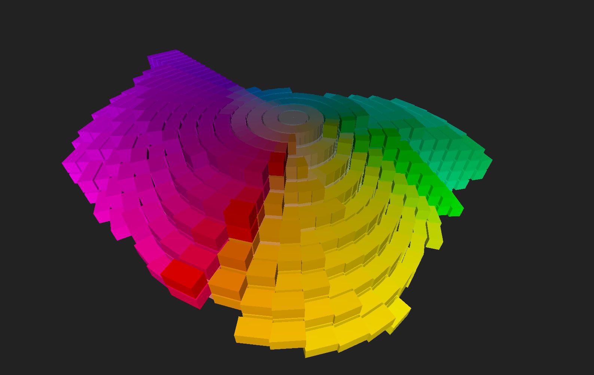

# workspace-rolodex

This three.js app was written with help from 
<a href="https://chat.openai.com/?model=gpt-4-code-interpreter">chat-gpt4-code-interpreter</a>    

Here's my Munsell Color Chips  in 3-D  

## See my related project <a href="https://github.com/sbecker11/workspace-munsell">workspace-munsell</a>

##  How to build this app
1. install node
2. in shell run "npm run build'
3. then run 'npm run start' 

